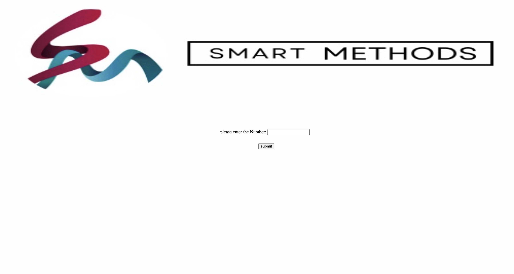
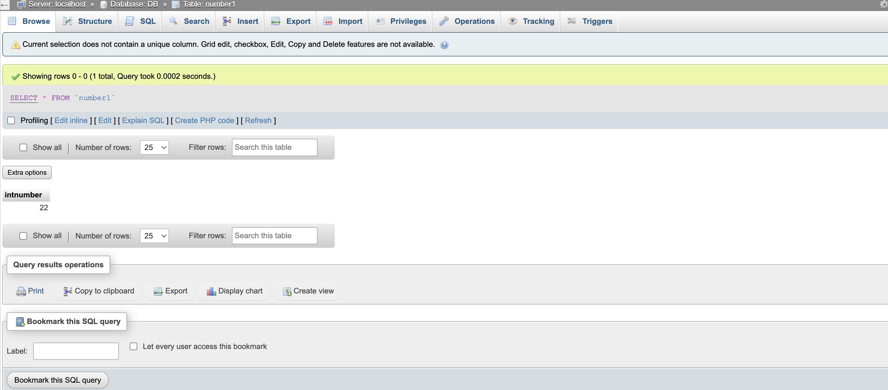

# task
## Create a page that receives a variable of type get and store the value in the database. Also create a page to display the values ​​stored in the database.

## Pictures of work applications

